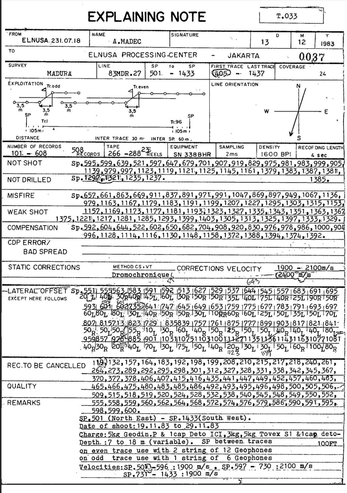

## Introduction

In the world of geophysics, coordinates are typically the foundation of all measurements and interpretations. They allow geophysicists to map subsurface features, such as faults, reservoirs, and layers, with precision. But what if, for some reason, you don’t have access to coordinates? How do you make sense of the data, and can meaningful geophysical imaging still occur?

The short answer is yes, it’s possible — but it becomes much more complex and requires creative solutions. Let’s explore what happens when coordinates are unavailable and how geophysicists can work around this limitation.

The training will stop once the model reaches convergence, meaning the loss function is minimized to an acceptable level. If convergence is not achieved, the training process continues by further adjusting the model parameters.

In Imaging Seismic can have many problems such as :
- **Offset (Near or Far offset)**
- **Static Corrections**
- **Velocity models**
- **NMO**


You can see the image to give informations for Shot Point (SP) but it's many gaps starting from 128 , 130, 135 etc. Consinstenly gaps with approximately 4 example started from **130**, 131, 132, 133, 134, **135** and without containing information coordinates. So we purpose to fill the gaps (n=4) using interpolations methods


<p>The formula for linear interpolation between two data points \((x_0, y_0)\) and \((x_1, y_1)\) is given by:</p>
<p>\(y = y_0 + \frac{(x - x_0)}{(x_1 - x_0)}(y_1 - y_0)\)</p>

<ul>
  <li>\(y\) is the interpolated value at \(x\),</li>
  <li>\(x_0\) and \(x_1\) are the known \(x\)-values,</li>
  <li>\(y_0\) and \(y_1\) are the known \(y\)-values,</li>
  <li>\(x\) is the input value where we want to estimate \(y\).</li>
</ul>

However, we try with other interpolations with using Cubic Spline. 
Spline interpolation uses piecewise polynomials (typically cubic polynomials) to interpolate between data points. One common method is cubic spline interpolation, which fits a cubic polynomial between each pair of adjacent data points and ensures smoothness at the data point boundaries.


<p><strong>Spline Interpolation:</strong> Spline interpolation fits a smooth curve between data points using piecewise polynomials. The most commonly used spline is the cubic spline, which uses cubic polynomials between each pair of adjacent data points.</p>

<p>The cubic spline equation for the segment between two data points \((x_i, y_i)\) and \((x_{i+1}, y_{i+1})\) is typically given by:</p>

<p>\[
S_i(x) = a_i(x - x_i)^3 + b_i(x - x_i)^2 + c_i(x - x_i) + d_i
\]</p>

<p>Where:</p>
<ul>
    <li>\(S_i(x)\) is the cubic spline polynomial for the segment between the points \((x_i, y_i)\) and \((x_{i+1}, y_{i+1})\),</li>
    <li>\(a_i, b_i, c_i, d_i\) are the coefficients determined by solving a system of equations that ensures smoothness (continuous first and second derivatives) across adjacent segments.</li>
</ul>

<p>The goal of spline interpolation is to ensure that:</p>
<ul>
    <li>The spline is continuous at the data points,</li>
    <li>The first and second derivatives of the spline are continuous at the data points, ensuring smoothness.</li>
</ul>

Lets try by scratch

```python
import numpy as np
import pandas as pd
import matplotlib.pyplot as plt
from scipy.interpolate import CubicSpline

# Read Data
data = pd.read_excel('83MDR-5_c.xlsx',sheet_name='Sheet12')

konstan = data['n'].values  # Kolom nilai konstan
x = data['x'].values
y = data['y'].values

# Titik yang ingin diinterpolasi (gap 1 untuk hasil halus)
t_interp = np.arange(min(konstan), max(konstan) + 1, 1)

# Interpolasi Spline Kubik untuk koordinat X dan Y
spline_x = CubicSpline(konstan, x)  # Interpolasi untuk X
spline_y = CubicSpline(konstan, y)  # Interpolasi untuk Y

# Hasil interpolasi
x_interp = spline_x(t_interp)
y_interp = spline_y(t_interp)

# Visualisasi
plt.plot(x, y, 'o', label='Data Asli')  # Titik Asli
plt.plot(x_interp, y_interp, '-', label='Interpolasi Spline')  # Garis Interpolasi
plt.legend()
plt.grid(True)
plt.xlabel('X')
plt.ylabel('Y')
plt.title('Interpolasi Spline untuk Koordinat')
plt.show()

# Menyimpan hasil interpolasi ke dalam CSV baru
hasil_interpolasi = pd.DataFrame({'konstan': t_interp, 'x': x_interp, 'y': y_interp})
hasil_interpolasi.to_csv('hasil_interpolasi.csv', index=False)

print('Interpolasi selesai. Hasil disimpan dalam file "hasil_interpolasi.csv".')


```


Okay , we get the data but still problem with inteporlations like :
- **Inconsistent interval data like interval shot point should be getting consisntenly / appromaxiamtely 60m**
- **Same problems like before, we tried and got inconsitensly for near offset should be in 30 me between shot point and first receiver**




