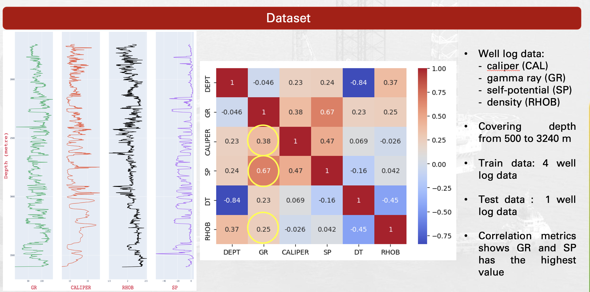
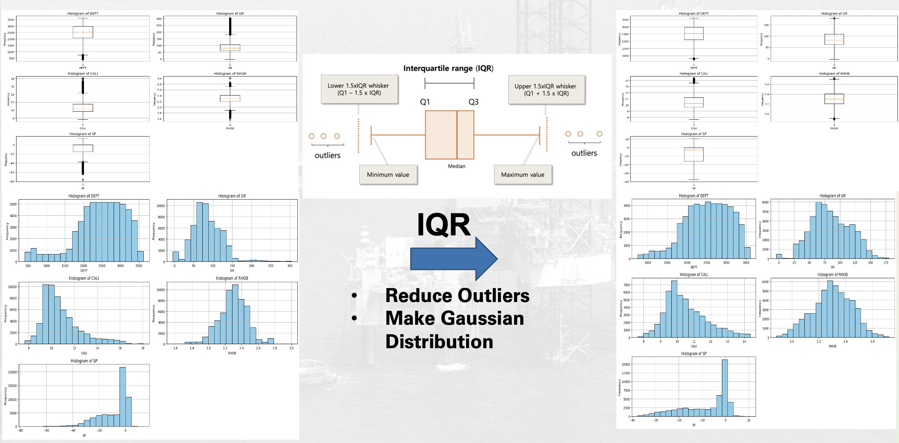
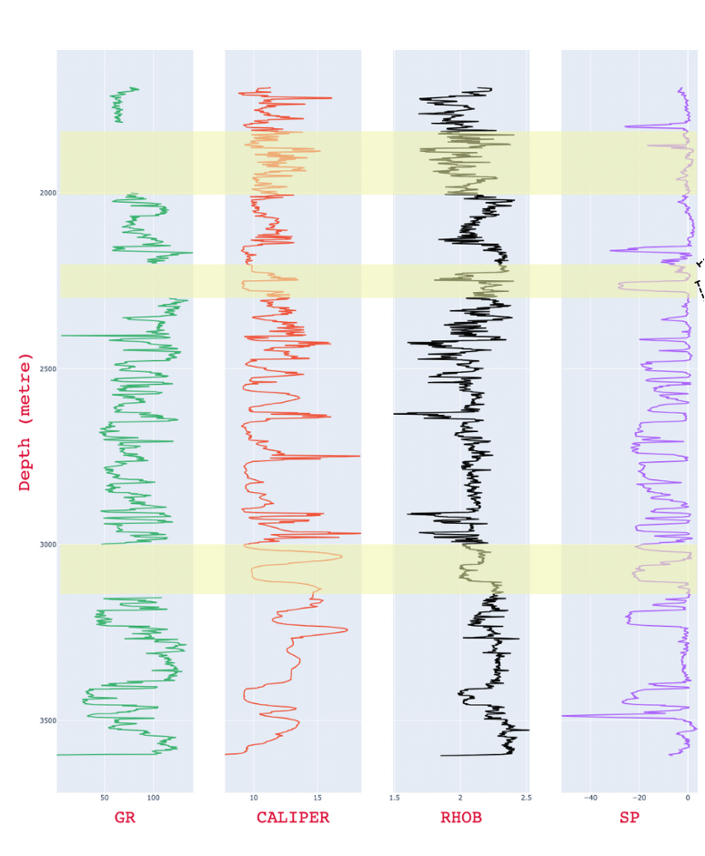
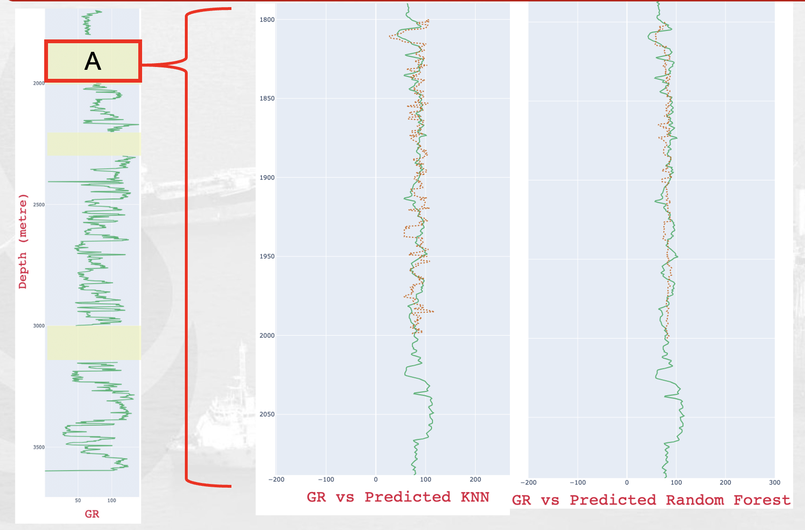
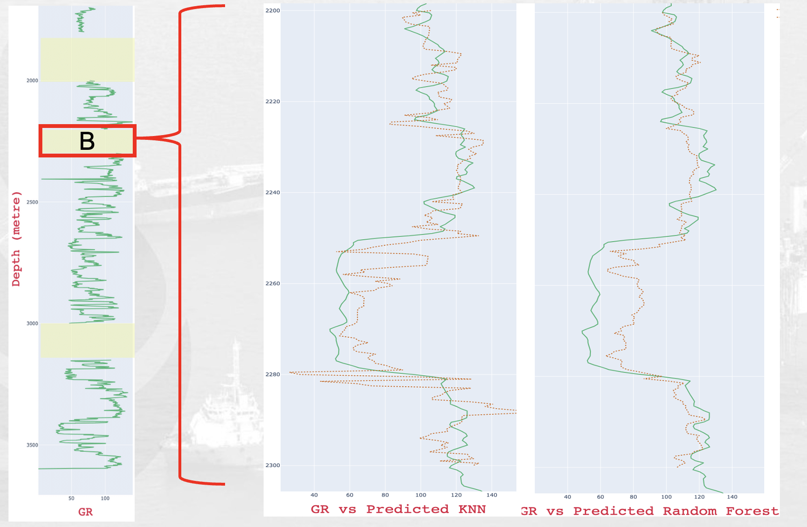
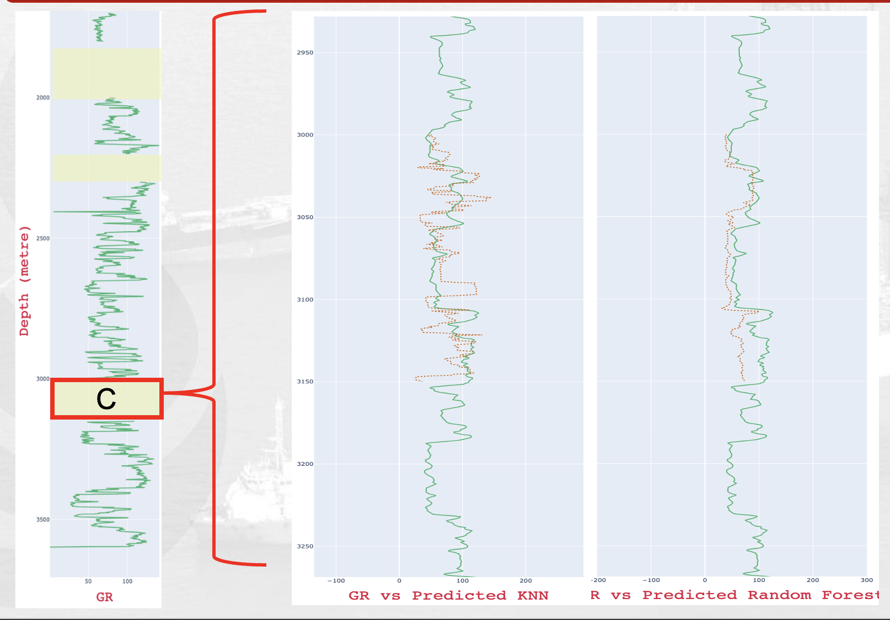
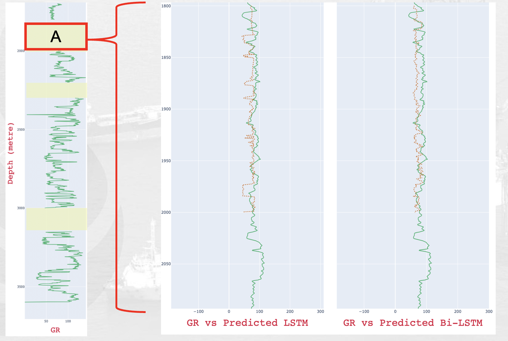
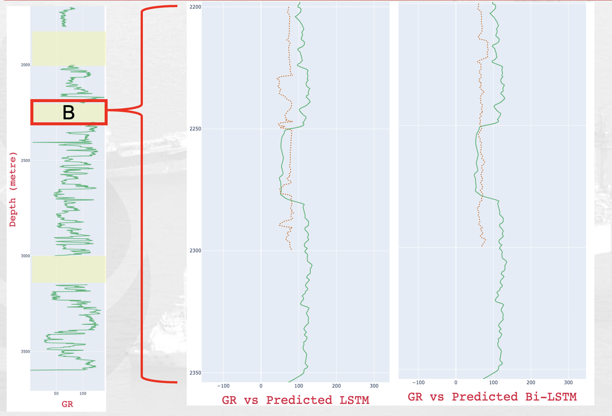
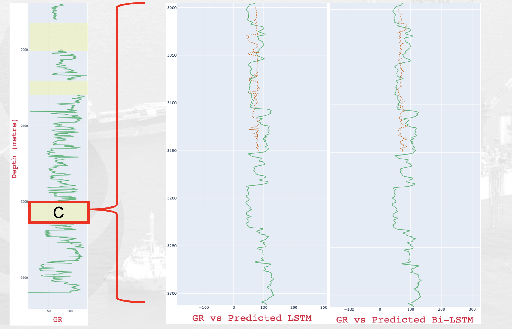

## Abstract
The oil and gas industry produces an immense quantity of complex data, including geological, seismic, and well log data. Machine learning can overcome the challenge of identifying trends that are difficult to recognize using conventional techniques. A well log, which contains subsurface information, is one of the most massive and complex types of data. The difficulty in this data processing originates from some intervals that experience data loss or drilling issues. The study used machine learning approaches to acquire predictive log Gamma Ray (GR) data by evaluating the window time base and applying machine learning algorithm in the form of Random Forest and K-Nearest Neighbor (KNN), also deep learning Long-Short Term Memory (LSTM) and Bi-LSTM. The field data utilized for the evaluation of each algorithm model is the Central Sumatra Basin. Following this, classification metrics are used to validate the test results of the algorithm, which yields an accuracy greater than 80% and the smallest mean absolute error (MAE) value. This validation provides an optimal score that can be used for empirical decision-making, giving priority to data with strong correlations. This research examines each model algorithm's ability to be proposed in a predictive analysis of well-logged data imputation rapidly and accurately.
 
## Main
In this research, we tried out several machine learning (ML) techniques to estimate missing log data, including Random Forest (RF), K-Nearest Neighbour (KNN), and deep learning models like Long Short-Term Memory (LSTM) and Bi-LSTM. Studies (Akinyemi et al., 2023; Feng et al., 2021; Gavidia et al., 2023) suggest that Random Forest works well, especially when the data range is more limited, leading to more accurate predictions. LSTM, on the other hand, is great at handling sequential data, allowing it to make predictions based on how information changes over time (Antariksa et al., 2023; Chakraborty et al., 2024; Zhang et al., 2024). Bi-LSTM takes it a step further by capturing complex temporal relationships in time series data, improving accuracy by analyzing the entire sequence (Cheng et al., 2022; Nath et al., 2022). Meanwhile, KNN is a simple yet effective non-parametric method that delivers solid classification results without making assumptions about data distribution. The catch? Choosing the right k value is crucial to getting the best classification performance (Kadri et al., 2022; Wood, 2020; Zhang et al., 2022).

We use log data from the Sintong field in the Central Sumatera Basin, covering depths from 500 to 3,240 meters. The dataset includes well logs like caliper (CAL), gamma ray (GR), self-potential (SP), and density (RHOB). After that we used correlation each other well and give the result GR and SP have the highest value but still low correlations (not too much strong)

and after that we provide to normalziation data before training model

we separated 3 sections in each log for testing the model after that

Table 1 shows the machine learning models optimized for prediction accuracy using GridSearch CV, which fine-tunes hyperparameters for both models. The Random Forest model uses 500 trees, while the KNN model is set to a maximum of 11 neighbors.

### Machine Learning Architecture Models  
|Machine Learning Architecture Models  |
|-------------|------------------|----------------------|
| Models    | Random Forest     | KNN                  |
| Depth       | 4-12             | -                    |
| Neighbors   | -                | 3-11                 |
| Weights     | -                | Uniform, Distance   |
| Estimators  | 100-500          | -                    |
| Features    | Auto, Square, Log | -                    |
| Time        | 28 Minutes        | 42 Seconds           |

Table 2 presents the deep learning models, including the parameters for LSTM and Bi-LSTM. We tested both models with different activation functions—ReLU and TanH. These activation functions play a crucial role in forecasting time-series values, with TanH outperforming the other two deep-learning models.

### Deep Learning Architecture Models  
|Deep Learning Architecture Models  |
|-------------|------------------|----------------------|
| Parameter      | LSTM    | Bi-LSTM  |
| Layers       | 32-256  | 64-128  |
| Activations  | ReLU    | TanH    |
| Dropout      | 0.1–0.2 | 0.1–0.2 |
| Epochs       | 250     | 250     |
| Dense Layers | 100     | 64      |

## Result
### Machine Learning Results
Among the machine learning models, KNN performed better than Random Forest in both speed and accuracy. It outshined Random Forest in making precise predictions. Shows the Blind Test results, where test data is split into three periods. The KNN model consistently delivered solid predictions across these time frames.

### ML Model Performance Metrics  

| ML Model       | Data        | MAE   | MSE    | RMSE  | R² Score |
|---------------|------------|-------|--------|-------|----------|
| Random Forest | Validation | 10.48 | 216.04 | 14.7  | 0.78     |
|               | Test       | 16.47 | 514.65 | 22.68 | 0.14     |
| KNN           | Validation | 7.63  | 181.25 | 13.46 | 0.822    |
|               | Test       | 17.67 | 578.33 | 24.04 | 0.004    |

### Deep Learning Results
For deep learning, both LSTM and Bi-LSTM (trained for 250 epochs) gave promising results. The model curve shows they converged well, with the lowest loss values at 0.3182 and 0.3136. Different activation functions were tested to optimize specific metric values. The Bi-LSTM model, in particular, showed lower RMSE and a solid R² score when using land activation. Both LSTM and Bi-LSTM excel at capturing complex patterns and trends in data, especially when dealing with nonlinear relationships and intricate data structures.

### DL Model Performance Metrics  

| DL Model  | Data        | MAE    | MSE    | RMSE   | R² Score |
|-----------|------------|--------|--------|--------|----------|
| LSTM      | Validation | 0.3192 | 0.2484 | 0.4984 | 0.7536   |
|           | Test       | 21.68  | 802.48 | 28.32  | 0.23     |
| Bi-LSTM   | Validation | 0.3136 | 0.234  | 0.4837 | 0.7679   |
|           | Test       | 21.00  | 780.01 | 27.92  | 0.32     |

## Conclusion
This study looks at how well two Machine Learning models (Random Forest and KNN) and two Deep Learning models (LSTM and Bi-LSTM) perform in predicting missing well log data, especially Gamma Ray. We evaluate each model using metrics like Mean Absolute Error (MAE), Root Mean Squared Error (RMSE), Mean Squared Error (MSE), and R² score.

In the well log test, KNN outperformed Random Forest, delivering a higher R² score and lower RMSE when predicting well log values. On the deep learning side, Bi-LSTM did better than LSTM in terms of R² score and RMSE, mainly due to differences in activation functions. That said, both models are great at identifying complex patterns and trends in data with nonlinear relationships.

