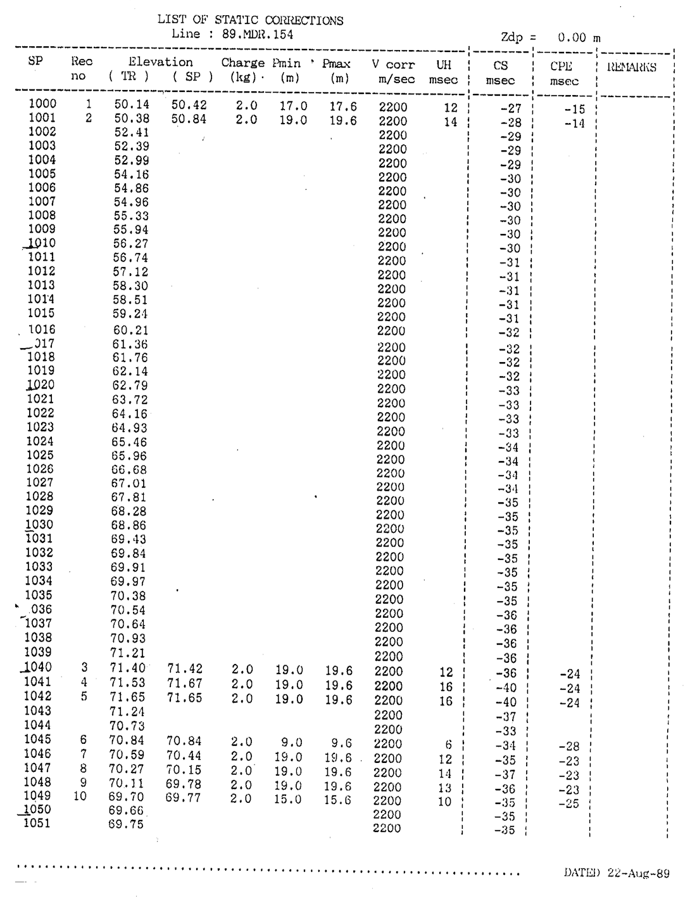
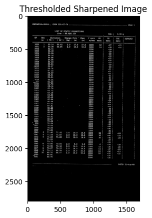
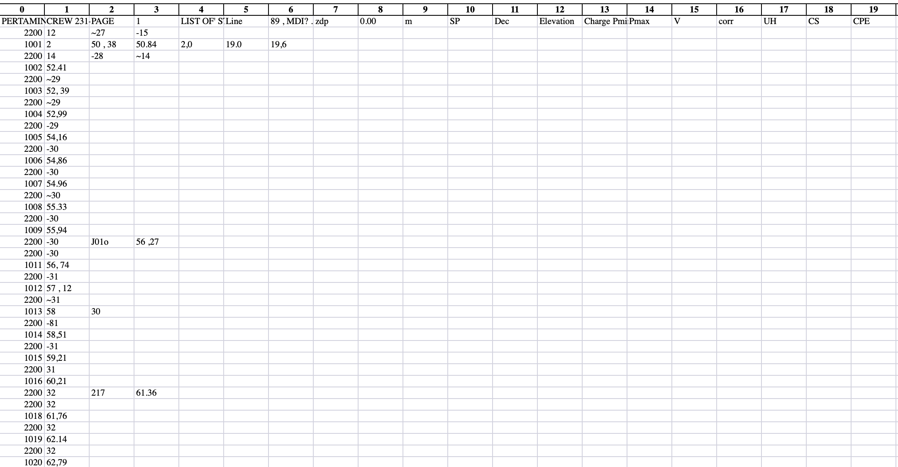

## Problem
Extracting text from an image can be exhausting, especially when you have a lot to extract. One commonly known text extraction library is PyTesseract or EasyOCR, optical character recognition (OCR). These libraries provide you with the text directly from the image.

When dealing with engineering or technical documents, like the one in this image, OCR tools can help quickly digitize content, which would otherwise require manual input. In this case, you can see a list of static corrections related to well logging or seismic corrections. The image includes various measurements such as elevation, charge, and V-corrections, commonly seen in geophysical data records.

Imagine having to manually extract and process hundreds or even thousands of images, each containing complex, tabulated data. Just think about it—over 100+ images of similar data that need to be converted into Excel sheets for further analysis or reporting. Without the help of OCR tools, this process would take days, if not weeks, of painstakingly typing out each value. But with OCR, what would have been a monumental task turns into a much more manageable job. The text extraction happens almost instantly, and the data is ready for further processing, analysis, or integration into reports.

OCR tools are especially helpful in industries like oil and gas, where seismic logs, drilling reports, and other technical documents are generated constantly. For example, if you're dealing with 100+ images of seismic data, you can automate the process, convert it to text, and then easily export it to an Excel sheet, making further analysis and visualization far easier and faster. What would’ve been an entire week’s worth of manual labor becomes a few minutes of processing.



You can look how many row and coloumn to convert from images to excel. It's so wasting time and that's why i need to solve the problem with using OCR

## Getting Started
When I write an algorithm, I always try to think of it like I’m teaching it the way humans naturally process information. This approach helps me break down complex ideas into simpler, more digestible steps. It’s like guiding someone through a process in the most intuitive way possible.

Take reading a table, for example. The first thing that catches your attention is usually the **cells**. These cells are like the building blocks of the table, neatly organized, waiting to be explored. You might notice that the cells are separated by **borders**—these borders can be either vertical or horizontal, providing structure and organization to the data. Once you identify these cells, you’re ready to dive deeper and understand the information contained within each one.

Now, let's break this process down into an algorithm. I imagine it like this: first, **cell detection**, where the algorithm identifies each individual cell—just like how your eyes recognize the compartments of the table. Where the algorithm selects the part of the table that holds the information we want to extract, much like you would focus on a specific section of the table. Finally, **text extraction** happens, where the algorithm pulls out the data from each selected region, transforming the visual information into usable text.

### Example Python Code


```python
import cv2
import numpy as np
from matplotlib import pyplot as plt

# Load the image
image = cv2.imread("/content/page_27.png")  # Replace with your image file path

# Convert to grayscale
gray = cv2.cvtColor(image, cv2.COLOR_BGR2GRAY)

# Sharpen the image using a kernel
sharpen_kernel = np.array([[-1, -1, -1], [-1, 9, -1], [-1, -1, -1]])
sharpen = cv2.filter2D(gray, -1, sharpen_kernel)

# Apply Otsu's thresholding
thresh = cv2.threshold(sharpen, 0, 255, cv2.THRESH_BINARY_INV + cv2.THRESH_OTSU)[1]

# Show the result
plt.imshow(thresh, cmap='gray')
plt.title('Thresholded Sharpened Image')
plt.show()
```


By thinking of the process this way, it becomes easier to translate human intuition into precise, step-by-step instructions for the algorithm to follow. This approach creates an algorithm that doesn’t just "work"—it mimics the way we naturally process and understand information, making it both powerful and intuitive.

```python
for item in r_easy_ocr:
            try:
                value = int(item)  # Try to convert the item to an integer
                if value > 1000:
                    if current_row:
                        processed_data.append(current_row)
                    current_row = [value]
                else:
                    current_row.append(item)
            except ValueError:
                current_row.append(item)  # Keep non-numeric values in the current row

        # Add the last row if it's not empty
        if current_row:
            processed_data.append(current_row)

        # Create a DataFrame from the processed data
        df_processed = pd.DataFrame(processed_data)

        # Save the DataFrame to a different sheet in one Excel file
        sheet_name = os.path.splitext(image_file)[0]  # Use image name as sheet name
        df_processed.to_excel(writer, sheet_name=sheet_name, index=False)

```

### Processing OCR Results and Identifying SP Numbers

When working with OCR (Optical Character Recognition) results, especially for structured data such as tables, it’s essential to organize the data in a way that makes it easier to analyze. In this case, the goal is to identify and separate **unique SP numbers**—values greater than 1000—from other data in the image. Here’s how the algorithm works:

1. **Iterating through the OCR results**:  
   The `r_easy_ocr` variable likely contains a list of text data extracted from an image using OCR. This loop goes through each item in the OCR results and processes them one by one.

2. **Identifying Unique SP Numbers (greater than 1000)**:  
   Each item in the list is first checked to see if it can be converted into an integer using `int(item)`. If the conversion is successful, the code checks if the resulting value is greater than 1000. In this case, numbers greater than 1000 are treated as **unique SP numbers**, which are used as identifiers for a new row in the data. This ensures that any SP number, which is a key identifier, is treated separately from other values.

3. **Grouping Data by SP Number**:  
   Once an SP number is found, it signifies the start of a new "row" in the data. The current row is appended to the `processed_data` list (if it isn’t empty), and a new row starts with the unique SP number. Any subsequent values that don’t meet the condition of being greater than 1000 are grouped into the current row until another unique SP number is encountered.

4. **Handling Non-Numeric Values**:  
   If the item cannot be converted into a number (e.g., text), it is appended to the current row as-is. This ensures that textual information or other non-numeric values are still captured and stored in the same row as the associated SP number.

5. **Finalizing the Rows**:  
   After the loop finishes, any remaining data in `current_row` is added to `processed_data`. This step ensures that the last set of data is also included in the result, even if there wasn’t another unique SP number to trigger its addition.

6. **Creating the DataFrame**:  
   The processed data is then converted into a **Pandas DataFrame**. This allows for easy organization and manipulation of the data, especially when dealing with tabular OCR results.

7. **Saving the Data**:  
   The final DataFrame is saved to an Excel file. Each image processed generates a separate sheet, with the name of the sheet corresponding to the image file name (without the file extension). This ensures that the data from each image is stored in its own sheet for easy reference.

---

### Key Takeaways:
- **Unique SP Numbers**: The algorithm is specifically designed to treat values greater than 1000 as unique identifiers (SP numbers) that separate different data entries, helping to maintain the integrity of the data.
- **Row Grouping**: Values associated with each SP number are grouped into rows, ensuring that related data stays together. Non-numeric values are handled gracefully without breaking the flow.
- **Excel Output**: The processed data is output to an Excel file, where each image’s data is stored in its own sheet for further analysis or reporting.

This approach ensures that the OCR data is well-structured, and key identifiers (SP numbers) are captured and used to organize the data effectively.

This is the resulted after OCR



## Results and Next Steps for Improvement

The algorithm successfully groups the OCR results into meaningful rows, using SP numbers (values greater than 1000) as unique identifiers. This approach effectively organizes the data and ensures that related information is stored together. However, after analyzing the results, there are a few areas where improvements can be made:

1. **Accuracy of OCR Output**:  
   The OCR process itself sometimes fails to capture numbers accurately, especially in images with poor quality or complex layouts. In some cases, OCR errors led to incorrect SP number identification or missing data. To address this, we can experiment with different OCR libraries (like Tesseract or EasyOCR) and fine-tune the preprocessing steps (such as denoising, adjusting image contrast, etc.) to improve the recognition accuracy.

2. **Handling Multiple SP Numbers in Close Proximity**:  
   In some cases, multiple SP numbers appeared close together, which may have caused the algorithm to misidentify data boundaries. A more sophisticated method of detecting and separating closely spaced SP numbers could help improve the results. For example, using image segmentation or adjusting the threshold for what constitutes an SP number could make this process more reliable.

3. **Improving Data Grouping Logic**:  
   While the current approach groups values into rows based on SP numbers, some edge cases—such as rows that span across multiple SP numbers or have multiple values greater than 1000—were not handled as expected. Future iterations could involve refining the logic to better capture these edge cases and ensure more accurate grouping of data.

4. **Handling Special Cases**:  
   Text-based values and annotations, while being correctly appended to rows, sometimes disrupted the flow of numerical data. Implementing a more nuanced approach to separate numeric data from textual information (e.g., using regular expressions to identify and categorize data types) could improve the final output.

---

### Key Takeaways:
- **Unique SP Numbers**: The algorithm effectively identifies SP numbers greater than 1000, treating them as unique row identifiers, which helps organize the data.
- **Grouping and Row Management**: Non-numeric values are handled appropriately, and the algorithm correctly groups related data under the right SP number.
- **Areas for Improvement**: Improving OCR accuracy, handling edge cases, and refining data grouping logic will lead to more reliable results in the future.

This approach provides a solid foundation for processing OCR results. However, as with any machine learning or OCR-based system, continuous improvement is necessary to handle new data variations and achieve higher accuracy. The next steps will focus on refining the algorithm, ensuring better handling of edge cases, and enhancing the overall performance of the OCR process.
